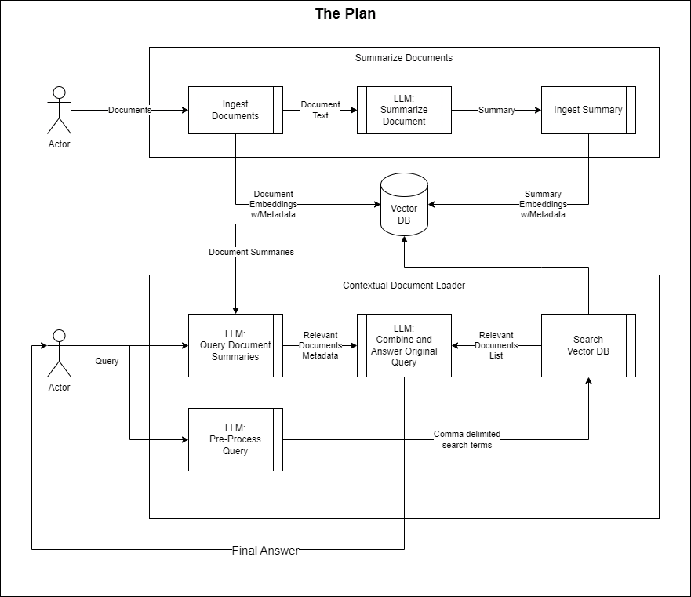

# DocTalk
DocTalk is a project I'm working on to try to build my own LLM document chat.  

I'm not 100% sure what I'm doing, but it's been great so far.  

Here's the plan:


I legit have no idea if this is going to be useful or anything, but it's certainly teaching me python, and renewing my interest in [snake_case](https://en.wikipedia.org/wiki/Snake_case) variables.

## **Random notes** 
Mostly copy/paste stuff I use (or used) frequently

### **Creating env**
``` shell
python -m venv doctalk_venv
```

### **Fixing pip issues-- upgrading pip, clearing cache, reinstalling dependencies**
``` shell
python.exe -m pip install --upgrade pip
pip cache purge
pip --no-cache-dir install -r requirements.txt
```
### **Why isn't my llama-cpp working on my GPU?**
Probably because you ran the `/requirements.txt` install before getting here.  Make sure to set these environment variables before installing llama-cpp next time.
``` powershell
$env:CMAKE_ARGS="-DLLAMA_CUBLAS=on"      
$env:FORCE_CMAKE=1
$env:LLAMA_CUBLAS=1   
```
And this next one is for when you have to force a re-install of llama-cpp because you left the instructions for the GPU below the `/requirements.txt` install 🙄

`pip install --no-cache-dir --force-reinstall llama-cpp-python`

### **Random CUDA Memory Error**
Sometimes a random CUDA memory error will show up.  Use this:
``` powershell
$env:GGML_CUDA_NO_PINNED=1
```

## **TODO List**
- langchain related (although I could do these manually if I want to spend the time learning it??):
  - Add tool to allow LLM to google search and provide answers (google sign in)
  - Add tool to allow the LLM to dynamically retrieve individual documents, vs. pre-processing a folder (e.g. from a website, or local folder)
    - repurpose [scrape_pdfs.py](/scrape_pdfs.py)
- Probably other things
- Documentation??  lol

## **Resources to look at**
- [Question answering using embeddings](https://github.com/openai/openai-cookbook/blob/main/examples/Question_answering_using_embeddings.ipynb)
- [Open LLM Leaderboard](https://huggingface.co/spaces/HuggingFaceH4/open_llm_leaderboard)
- Best source for models: [TheBloke on HuggingFace](https://huggingface.co/TheBloke)
- [LangChain Dev Blog](https://blog.langchain.dev/)